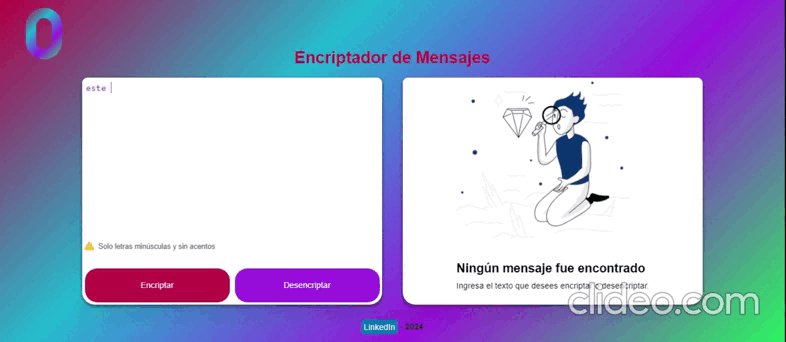
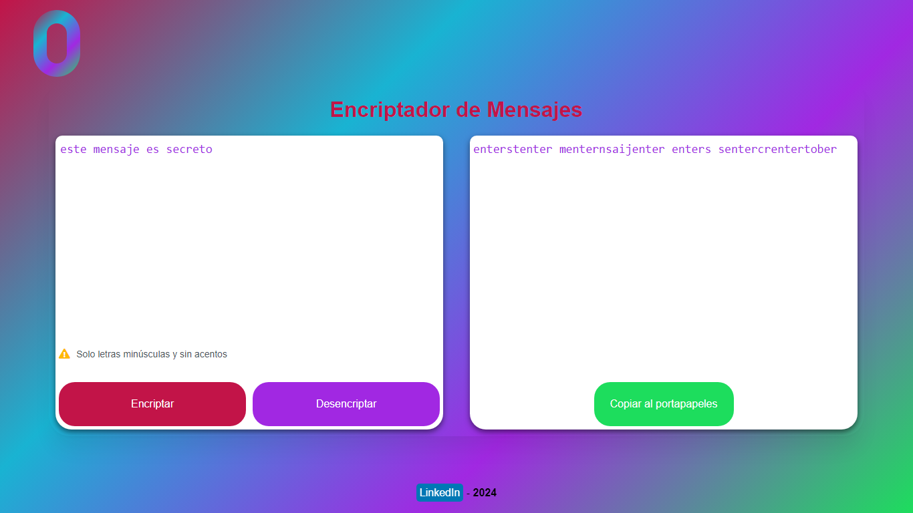
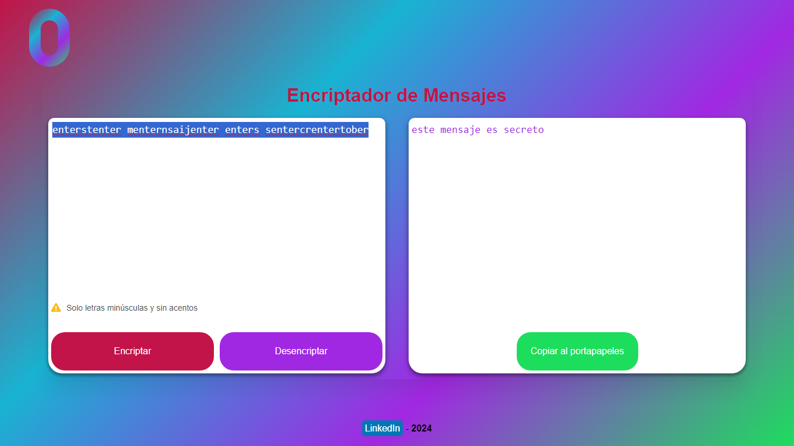
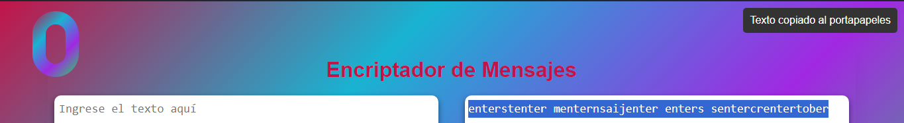
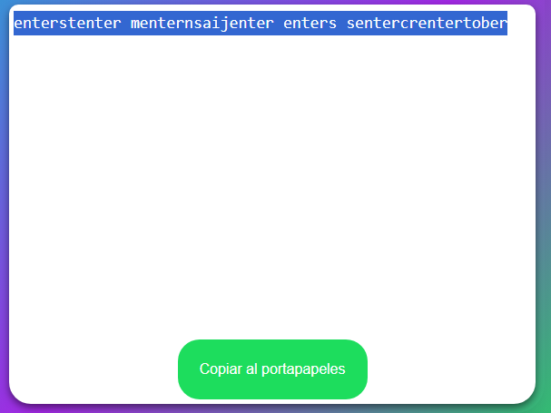
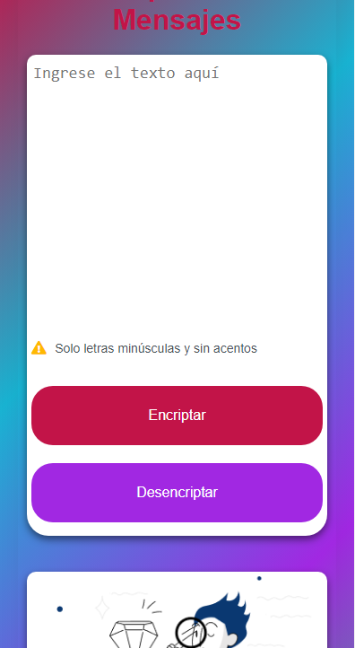
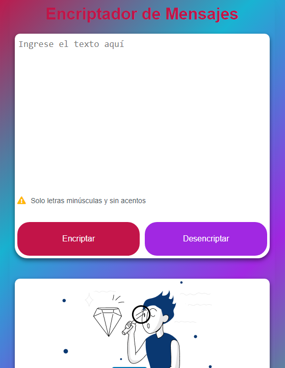
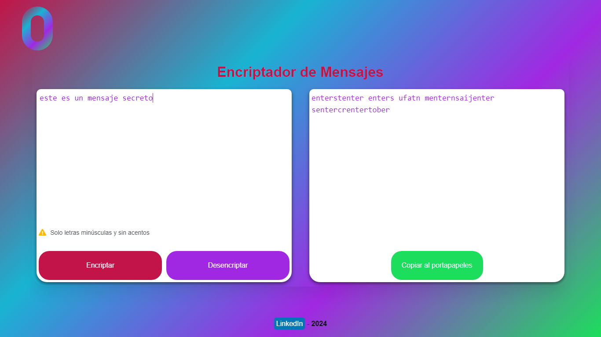

# Documentación del Encriptador de Mensajes

## Índice

1. [Introducción](#introducción)
2. [Tecnologías Utilizadas](#tecnologías-utilizadas)
3. [Instalación](#instalación)
4. [Uso](#uso)
5. [Características](#características)
6. [Estructura del Proyecto](#estructura-del-proyecto)
7. [Funciones Principales](#funciones-principales)
    - [Función de Encriptado](#función-de-encriptado)
    - [Función de Desencriptado](#función-de-desencriptado)
8. [Funciones Adicionales](#funciones-adicionales)
   - [Validación de Entrada](#validación-de-entrada)
   - [Notificaciones](#notificaciones)
   - [Copiar al Portapapeles](#copiar-al-portapapeles)
   - [Atajos de Teclado](#atajos-de-teclado)
   - [Responsive Design](#responsive-design)
9. [Contribución](#contribución)
10. [Licencia](#licencia)

## Introducción

El Encriptador de Mensajes es una herramienta que permite encriptar y desencriptar mensajes de texto utilizando un conjunto de reglas específicas. Esta aplicación es ideal para mantener la privacidad de tus mensajes de texto.

## Tecnologías Utilizadas
- HTML5
- CSS3
- JavaScript (ES6+)

## Instalación

Para instalar y ejecutar este proyecto, sigue los siguientes pasos:

1. Clona este repositorio:
```
git clone https://github.com/tu-usuario/encriptador-mensajes.git
```

2. Navega al directorio del proyecto:

cd encriptador-mensajes

3. Abre el archivo `index.html` en tu navegador web preferido.

## Uso
1. Ingresa el texto que deseas encriptar en el área de entrada.
2. Haz clic en el botón "Encriptar" para codificar el mensaje.
3. Para desencriptar, ingresa el texto codificado y haz clic en "Desencriptar".
4. Utiliza el botón "Copiar al portapapeles" para copiar el resultado.



## Características
- Encriptación y desencriptación de texto
- Validación de entrada en tiempo real
- Copiar resultado al portapapeles
- Diseño responsive
- Notificaciones de acciones realizadas

## Estructura del Proyecto

```
root
│
├── favicon.ico
├── index.html
├── docs/
│   └── documentacion_encriptador_mensajes.md
└── assets/
    ├── css/
    │   └── style.css
    ├── js/
    │   └── script.js
    └── images/
        ├── munieco.png
        └── favicon.ico
```

## Funciones Principales

### Función de Encriptado

La función de encriptado reemplaza cada vocal en el texto con una secuencia de caracteres específica.

```javascript
function encrypt(text) {
    inputText.value = '';
    return text.replace(/[aeiou]/g, letter => encryptRules[letter]);
}
```



### Función de Desencriptado

La función de desencriptado reemplaza las secuencias de caracteres específicas con las vocales correspondientes.

```javascript
function decrypt(text) {
    let decrypted = text;
    inputText.value = '';
    Object.entries(encryptRules).forEach(([key, value]) => {
        decrypted = decrypted.replace(new RegExp(value, 'g'), key);
    });
    return decrypted;
}
```



## Funciones Adicionales

### Validación de Entrada
La aplicación valida la entrada del usuario en tiempo real, permitiendo solo letras minúsculas, números y espacios.

```javascript
const validateInput = () => {
    const invalidChar = /[^a-z0-9\s]/g;
    if (invalidChar.test(inputText.value)) {
        noMessageDiv.classList.add('warning');
    } else {
        noMessageDiv.classList.remove('warning');
    }
    inputText.value = inputText.value.replace(invalidChar, '');
};

inputText.addEventListener('input', validateInput);

inputText.addEventListener('keydown', event => {
    const invalidChar = /[^a-z0-9\s]/g;
    if (event.key === 'Backspace' || event.key === 'F5') {
        return;
    } else if (invalidChar.test(event.key)) {
        event.preventDefault();
    }
    
    if (event.key === 'Enter') {
        event.preventDefault();
        const text = inputText.value.toLowerCase();
        showResult(encrypt(text));
        inputText.select();
    }

    if (event.key === 'Enter' && event.shiftKey) {
        event.preventDefault();
        const text = inputText.value;
        showResult(decrypt(text));
        inputText.select();
    }
});
```

### Notificaciones
Las notificaciones se utilizan para informar al usuario sobre el estado de las acciones, como copiar texto al portapapeles.



### Copiar al Portapapeles

Permite al usuario copiar el texto encriptado/desencriptado al portapapeles.



### Atajos de Teclado
- Presiona 'Enter' para encriptar automáticamente.
- Usa 'Shift + Enter' para desencriptar.

### Responsive Design
La interfaz se adapta a diferentes tamaños de pantalla, desde dispositivos móviles hasta pantallas de escritorio.

<div style="display: flex; justify-content: space-between;">
  
  
  
</div>

### Contribución
Las contribuciones son bienvenidas. Por favor, sigue estos pasos para contribuir:
1. Haz un fork del repositorio
2. Crea una nueva rama (`git checkout -b feature/AmazingFeature`)
3. Haz commit de tus cambios (`git commit -m 'Add some AmazingFeature'`)
4. Haz push a la rama (`git push origin feature/AmazingFeature`)
5. Abre un Pull Request

---
Esta documentación proporciona una guía completa para entender y utilizar el Encriptador de Mensajes. Asegúrate de seguir las instrucciones de instalación y revisa cada sección para obtener el máximo provecho de la herramienta.

### Licencia
Distribuido bajo la Licencia MIT.


